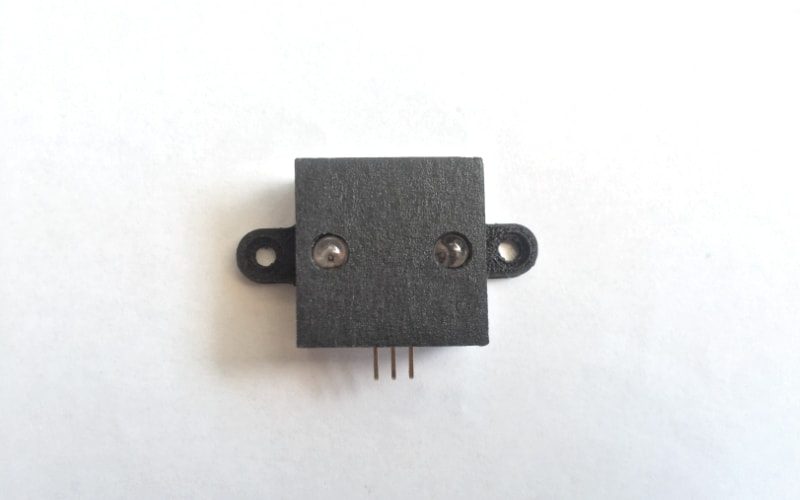
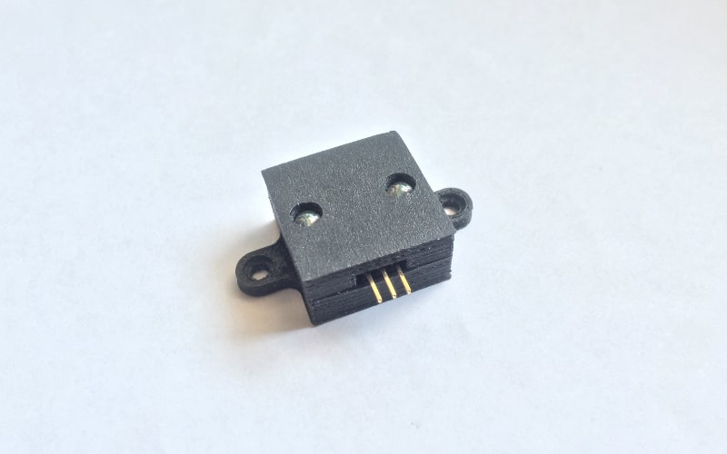

#### LEDAR
The LEDAR is a 23x23mm open-source, stand-alone, programmable reflectometer/proximity sensor based on ATtiny85. It is engineered to be easily configurable, have a range of 6 meters in ideal conditions and to be easily crafted at home with common DIP components. To make this device accessible to many at a really low cost, the photodiode chosen for detection is the same used for emission, a simple visible light, infrared or ultraviolet LED.

```cpp  
 _______   _______   _______   _______   _______
|       | |       | |       | |       | |       |   ___/\/\/\___ GND
| LEDAR | | LEDAR | | LEDAR | | LEDAR | | LEDAR |  |   1-5 MΩ
|_______| |_______| |_______| |_______| |_______|  |  
 ___|||_______|||_______|||_______|||_______|||____|_ SoftwareBitBang bus
 ____||________||________||________||________||______ +5v
 _____|_________|_________|_________|_________|______ GND
```
Many LEDAR modules can be connected to the same [SoftwareBitBang](../../../strategies/SoftwareBitBang/README.md) bus.

Its detection method is based on the interesting ability of LEDs, if hit by light, to produce a tiny amount of electricity thanks to the photo-electric effect, and a usable voltage range for the ATtiny85's ADC.

Its sampling method is based on reflectometry and on two different samples:
- Background noise or ambient light sample `B`
- Sampling while emitting light `E`

Reflex intensity or `R` is estimated simply subtracting the background noise sample to the active one `(R = E - B)`.

To higher reflex detection resolution, it is used the internal 1.1v analog reference and analog readings integration. A LEDAR module can be used for reflectometry/proximity/presence detection, although could be used also for wireless communication using the [AnalogSampling](../../../strategies/AnalogSampling/README.md) strategy and a custom made sketch. Its detection mode can be set to `0` (passive mode), where only presence detection is transmitted if threshold is reached or `1` (active mode) where the sensor cyclically transmits data. The operation mode, reading iterations, detection threshold and transmission interval are configurable using a simple set of commands using the [SoftwareBitBang](../../../strategies/SoftwareBitBang/README.md) bus used also for data output.

##### List of materials
- 1x breadboard or proto-board or PCB    
- 1x 4 pin DIP socket                    
- 1x ATtiny85                            
- 1x 16Mhz crystal oscillator            
- 1x Photodiode / LED (also normal LED emitters can be used as photodetectors)   
- 1x Resistor to set correct emitter LED's supply voltage                     
- 1x LED chosen to match photodiode's peak spectrum sensitivity          
- 1x 1-10MΩ resistor used to pull down detector's output                 
- 1x 3 pin 2.54mm interface                                              

#### Circuit
The circuit is quite simple and can be tested quickly on a breadboard. It is composed by 6 elements, the MCU, its clock, a couple of resistors and a couple of LEDs. Here you can see a more advanced version with its own dedicated printed circuit board and a 3d printed case, used to higher sensitivity and avoid direct line of sight between the emitter and the sensor.




#### Configuration
A standard program is proposed to let users easily configure LEDARs using only a series of commands on its PJON [SoftwareBitBang](../../../strategies/SoftwareBitBang/README.md) bus, and automatically save its result in the EPROM to avoid the tedious need of flashing the chip multiple times:

| COMMAND                         | PARAMETER     | EFFECT                        |
| --------------------------------| --------------| ------------------------------|
|  `C` Header configuration       | `uint8_t`     | Sets header configuration     |
|  `D` Detection threshold        | `uint16_t`    | Sets new detection threshold  |
|  `E` Reading request            | none          | Requests a new reading        |
|  `I` Id configuration           | `uint8_t`     | Sets a new id                 |
|  `L` Reading iterations         | `uint16_t`    | Sets new iterations count     |
|  `M` Mode configuration         | `uint8_t`     | Sets operation mode           |
|  `Q` Configuration block        | none          | Blocks incoming configuration |
|  `R` Recipient id configuration | `uint8_t`     | Sets new recipient id         |
|  `T` Transmission interval      | `uint16_t`    | Sets new transmission interval|
|  `X` Configuration reset        | none          | Sets configuration to default |

Using the proposed [Console](software/Console/Console.ino) example and an Arduino compatible device it is possible to input configuration with an easy to use console interface.

This device has been engineered with the strong feeling that, in future, "smart houses" will not necessarily host a moltitude of inefficient and convoluted embedded real-time operative systems in whatever "thing", consuming a lot of power and exposing vulnerabilities also outside the physical perimeter of houses running Ethernet over WiFi; but more probably, will host many small dedicated microcontrollers connected to a wired, common, open-source, lightweight and less power consuming communication bus, unhackable without direct physical access to its wiring.

LEDAR should be considered as a general "guideline" on how PJON compatible devices can be published and shared with other PJON users through the devices directory. Feel free to make a pull request proposing a new device you have engineered.   
